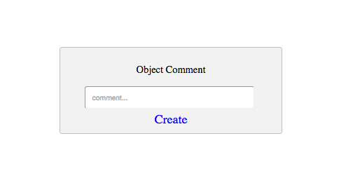

# starterTemplate-Object-Comments-API
a starter template for creating object comments using the Stamplay Rest API

**NOTE: Users must be logged in to use the comment function!**

**CLONING: When cloning this repo, you must initialize your app first to make it work.**

 1) **Initialize the front-end of your app with Stamplay**
 <br>
- Go to your command line and enter **stamplay init**
- When prompted, enter your **appID** & **API Key**

2) **Establish object to be commented on**
- Go to your Stamplay editor and go to the **Data** section. Then go to **Objects**
- Establish which object in the collection your going to comment on by getting it's  **object Id**.

3) **Comment**
```
function createObjectComment(){

	var comment = document.getElementById('comment').value;

	var data = JSON.stringify({
  		"text": comment
	});

	var xhr = new XMLHttpRequest();
	xhr.withCredentials = true;

	xhr.addEventListener("readystatechange", function () {
  		if (this.readyState === this.DONE) {
    		console.log(this.responseText);
  		}
	});

	xhr.open("PUT", "https://[yourappid].stamplayapp.com/api/cobject/v1/:cobjectId/:id/comment");
	xhr.setRequestHeader("accept", "application/json");
	xhr.setRequestHeader("content-type", "application/json");
	xhr.send(data);
}
```


